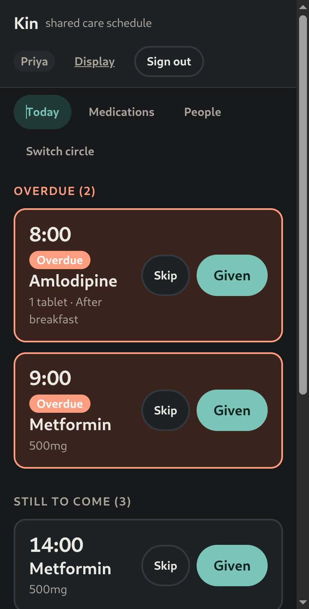
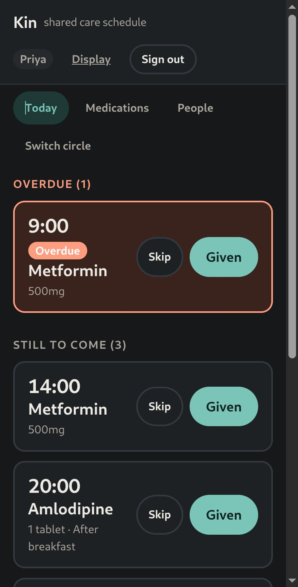
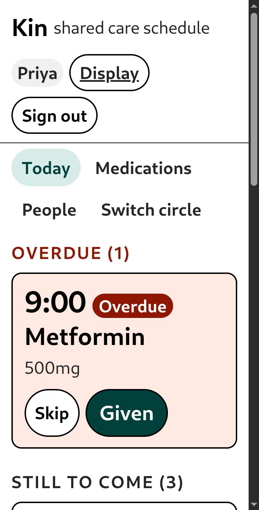

# Kin

A shared medication schedule for a family looking after one relative.

When several people share the care of a parent or grandparent, the hardest part
is not remembering the schedule. It is knowing what somebody else already did.
Your brother came by at eight; did he give the blood pressure tablet, or did he
assume you had? The usual answer is a WhatsApp group and a pill box, and the
usual failure is a dose given twice or not at all.

Kin is one schedule everybody can see, with a record of who did what.



## The problem it actually solves

Two people in the same house, both holding a phone, both about to give the same
tablet.

That is a race, in the technical sense, with a real consequence. Kin resolves it
in two places:

**Before it happens.** Every phone watching the circle is updated over a
WebSocket the moment somebody records a dose, so the second person usually sees
it already ticked and never reaches for the bottle. Below, Priya's screen after
Arjun marked the eight o'clock dose from his own phone — no refresh, and the
overdue count drops from two to one:



**When it happens anyway.** If two requests do land together, the update is
conditional on the dose still being unresolved — a single atomic
`findOneAndUpdate`, not a read followed by a write. Exactly one wins. The other
is told who got there first and what they recorded, which is the thing they
actually need to know.

That behaviour is tested, and the test is verified to bite: replacing the
conditional update with a naive read-then-write fails both concurrency tests —
the two-person race and the five-simultaneous-taps case — and restoring it
passes them. A concurrency test that passes against a broken implementation is
worth nothing.

## Accessibility is the product, not a setting

The people using this are often in their seventies, reading a phone at arm's
length in a bright kitchen. So text size and contrast sit in plain view rather
than behind an "accessibility" heading, because for these users larger text is
not an accommodation — it is how they read.



Everything scales together, including the tap targets. Building this found a
real bug: at the largest setting the buttons could not fit beside the medication
name, and a rigid two-column grid pushed them off the edge — a horizontal
scrollbar and a half-visible "Given" button, in the one configuration the
intended users are most likely to be in. The layout now wraps instead.

Also here, and all of it load-bearing rather than decorative:

- A single polite ARIA live region announces changes that happen without the
  user doing anything — "Arjun marked Amlodipine as given". Without it, a screen
  reader user is told nothing and later finds the dose ticked with no idea why.
- Every "Given" button is labelled with its drug and time, so a screen reader
  user is not choosing between six buttons all called "Given".
- Full keyboard operation, a skip link to the dose list, visible focus rings,
  and `prefers-reduced-motion` respected.

## Reminders

A dose going overdue is the one thing that has to reach somebody who is not
looking at the app. Kin sends a web push notification when a dose is more than
half an hour late.

The rules are deliberately strict, because notifications are the feature people
switch off:

- **Only when genuinely late.** Past the due time by the grace period, not at it.
- **Once per dose, ever.** A `remindedAt` field is claimed with the same
  conditional update the resolve endpoint uses, so two overlapping sweeps cannot
  both send. A duplicate notification about medication is exactly the kind of
  thing that prompts somebody to give a second tablet.
- **Only to people who can act.** Admins and caregivers. A viewer cannot record
  a dose, so waking them achieves nothing.
- **Never to a dose already dealt with**, even if it was resolved in the moment
  between the query and the send.

The sweep is a `setInterval` in the API process. That is honest for a
single-instance deployment and has nothing to forget to deploy; it is also the
first thing that would have to move to a dedicated worker to run more than one
instance, since every instance would otherwise sweep. The atomic claim makes
that safe but wasteful.

Push is optional. Without VAPID keys the app works completely and simply never
notifies — a missing key is a disabled feature, not a boot failure.

## Timezones, properly

A medication says "08:00". That is a wall clock instruction, and a wall clock is
not a moment in time until you know where the clock is. Every circle carries an
IANA timezone, and doses are converted through it.

The awkward case is handled explicitly: on the day a zone springs forward, an
08:00 that never happens is reported as skipped rather than invented or silently
shifted by an hour. For medication timing, a quiet one-hour shift is a real
error.

## Running it

Needs Node 20+ and a local MongoDB.

```bash
npm install
npm run mongo:start          # or point MONGO_URI at your own
npm run dev                  # API on :4000, app on :5173
npm test                     # 41 tests
```

`.env.example` lists the configuration; defaults work for local development, and
the server refuses to boot in production without real JWT secrets.

## How it fits together

```
server/src/models/      the whole domain in one file — it reads better together
server/src/services/    schedule generation, timezone conversion, tokens
server/src/routes/      auth, circles, medications, occurrences
server/src/sockets/     per-circle rooms, authenticated at connection
client/src/pages/       Today, Medications, People, Circles, Settings
client/src/hooks/       auth, live updates, display settings, announcements
```

**Medication and Occurrence are separate.** A schedule alone cannot record that
Tuesday's evening dose was skipped because he was asleep, or that it was given
at 20:40 rather than 20:00. Those facts belong to the individual dose, so the
individual dose exists as a row.

**Doses are materialised on read.** Generation is idempotent, guarded by a
unique index on `(medication, dueAt)`, so a circle nobody has opened for a
fortnight still shows a full schedule the moment somebody does. There is no cron
job to forget to deploy and nothing that can fall behind. Fields a human may
have set are written only on insert, so regenerating never un-ticks a dose
somebody already gave.

**Auth uses a short-lived access token in memory plus a refresh token in an
httpOnly cookie**, rather than the usual long-lived JWT in localStorage that
anything running on the page can read.

**A circle you cannot see returns 404, not 403.** Answering 403 would confirm it
exists, which leaks the existence of other families' data to anyone guessing ids.

## Limitations

Real ones, in rough order of how much they would matter to someone using it:

- **Push delivery is verified server-side, not end to end.** The reminder rules
  have tests, including a negative control, and the VAPID pipeline is wired and
  running. What has not been exercised in a browser is the permission grant and
  an actual notification arriving on a device, because that needs a human to
  click Allow. Treat it as working-but-unproven until you have seen one land.
- **No invitation emails.** You can only add someone who has already signed up.
- **No offline support.** A phone with no signal cannot record a dose, which in
  a hospital corridor is exactly when you would want to.
- **No audit history.** Undo overwrites; it does not keep the prior version. For
  a medication record that is arguably wrong, and a real deployment would append
  rather than mutate.
- Doses are materialised a fortnight ahead, so a schedule edit only affects that
  window until somebody opens the app again.
- The frontend has no automated tests. It has been exercised by hand, including
  the real-time and accessibility paths shown above, but that is not the same
  thing.

## Licence

MIT.
